# StreamWave Content Performance Analytics


## Project overview

StreamWave is a fictional global streaming platform. This project analyzes 18 months of title-level viewing activity to identify what audiences watch, where engagement is strongest, how device behavior affects completion, and which subscription tiers contribute the most estimated revenue.

The dataset was inspired by the structure of a public streaming-engagement report, then expanded into a fully synthetic dataset with geographic, content, device, engagement, and commercial dimensions. No real customers or confidential company data are included.

## Business questions

1. Which titles and genres attract the most views?
2. How does engagement change over time?
3. Which genres perform best in each region?
4. Which devices deliver the strongest completion rates?
5. How do subscription tiers differ in audience scale and estimated revenue?
6. Do global releases outperform limited releases?
7. Which titles combine reach, completion, and strong ratings?

## Tools and skills

- **PostgreSQL:** staging tables, CTEs, data types, conditional logic, deduplication, window functions, aggregations, indexes, and quality checks
- **Python:** pandas, data cleaning, grouped analysis, matplotlib, and seaborn
- **Analytics:** KPI design, trend analysis, audience segmentation, content performance, and recommendation writing
- **GitHub:** reproducible repository structure, documentation, data dictionary, and visual storytelling

## Dataset

The raw file contains **15,035 rows**, covering:

- 180 synthetic movies and series
- 14 countries across 6 regions
- 18 reporting months from January 2025 to June 2026
- 9 genres, 9 original languages, 5 device types, and 3 subscription tiers

Each record represents viewing activity for a title, reporting month, country, subscription tier, and primary device. The generator creates seasonal demand, launch decay, geographic preferences, and device-level behavior. It also injects duplicates, missing values, inconsistent text, and invalid date relationships for realistic cleaning practice.

See the complete [data dictionary](docs/data_dictionary.md).

## Repository structure

```text
streamwave-analytics/
├── data/
│   ├── raw/streamwave_viewing_raw.csv
│   └── processed/streamwave_viewing_clean.csv
├── docs/
│   ├── data_dictionary.md
│   └── portfolio_walkthrough.md
├── images/
│   ├── sql_screenshots/
│   │   ├── 01_raw_data_imported.png
│   │   ├── 02_data_quality_check.png
│   │   ├── 03_top_10_titles.png
│   │   ├── 04_genre_performance.png
│   │   ├── 05_monthly_growth_trend.png
│   │   ├── 06_regional_genre_ranking.png
│   │   └── 07_high_potential_titles.png
│   ├── 01_top_titles.png
│   ├── 02_monthly_views.png
│   ├── 03_genre_reach_completion.png
│   ├── 04_device_completion.png
│   ├── 05_region_genre_heatmap.png
│   └── 06_tier_revenue.png
├── python/
│   ├── generate_synthetic_data.py
│   └── eda_analysis.py
├── sql/
│   ├── 01_create_tables.sql
│   ├── 02_clean_transform.sql
│   └── 03_analysis_queries.sql
├── README.md
└── requirements.txt
```

## Data preparation

The SQL pipeline:

1. Loads every field as text into a raw staging table.
2. Trims whitespace and standardizes text capitalization.
3. Converts dates, integers, decimals, and booleans to appropriate types.
4. Removes duplicate business-key records with `ROW_NUMBER()`.
5. Rejects impossible dates, negative activity, and invalid runtimes.
6. Imputes missing ratings and completion rates using content-type and genre averages.
7. Adds monthly view share and title age in months.
8. Creates indexes for common analysis fields.
9. Runs final null and duplicate checks.

## SQL workflow and results

### Raw data imported

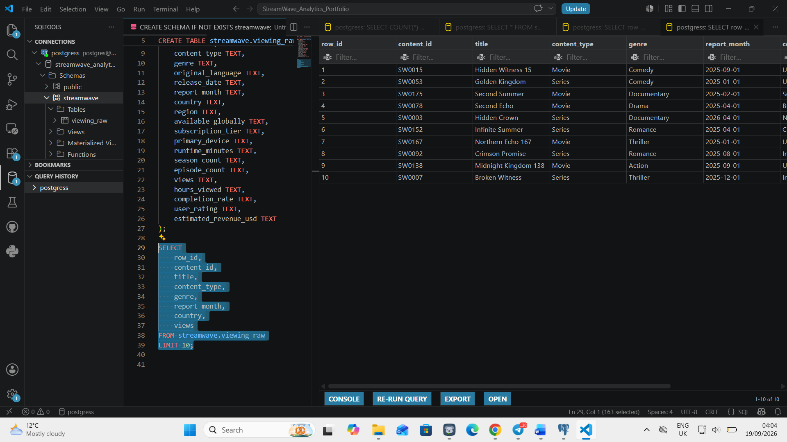

The raw CSV was loaded into a PostgreSQL staging table containing **15,035 records**. Loading the fields as text first protected the import from failing before data-quality problems could be investigated.

### Data-quality validation

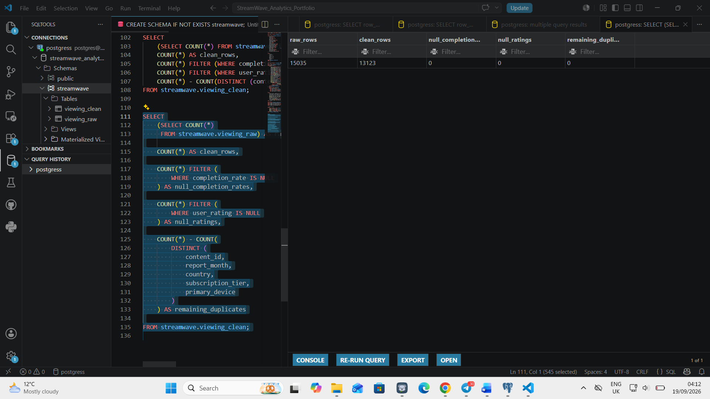

After transformation, the analytical table contained **13,123 valid unique records**, with no missing completion rates, no missing ratings, and no remaining duplicate business keys.

### Top-performing titles

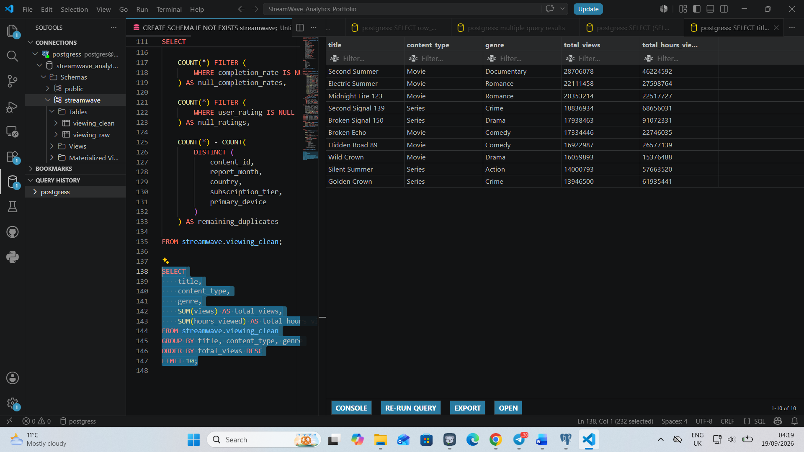

The query uses `SUM`, `GROUP BY`, `ORDER BY`, and `LIMIT` to identify the titles generating the most views and viewing hours.

### Genre performance

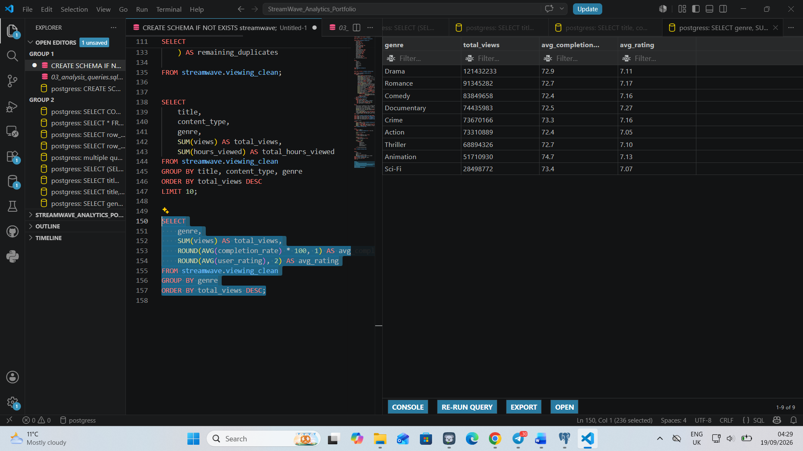

Genre performance was evaluated across audience reach, completion, and average rating so that popularity was not treated as the only measure of success.

### Month-over-month growth

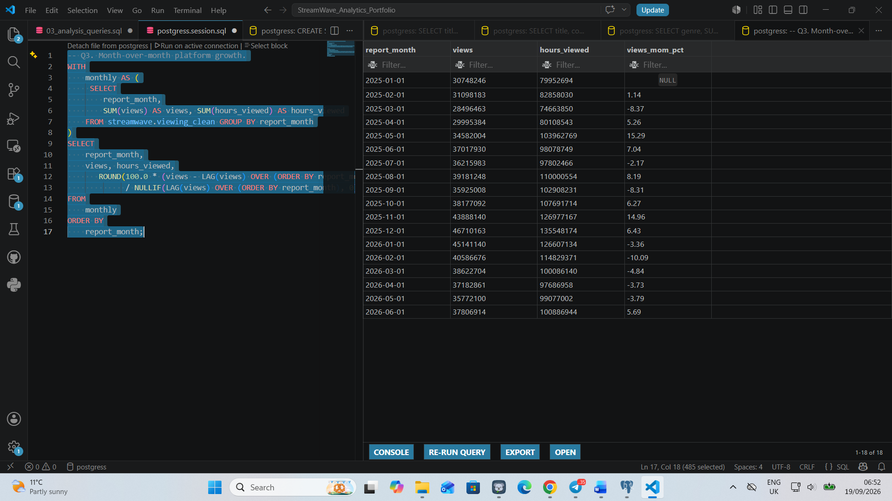

The `LAG()` window function compares each month with the previous month and highlights the year-end viewing peak.

### Regional genre ranking

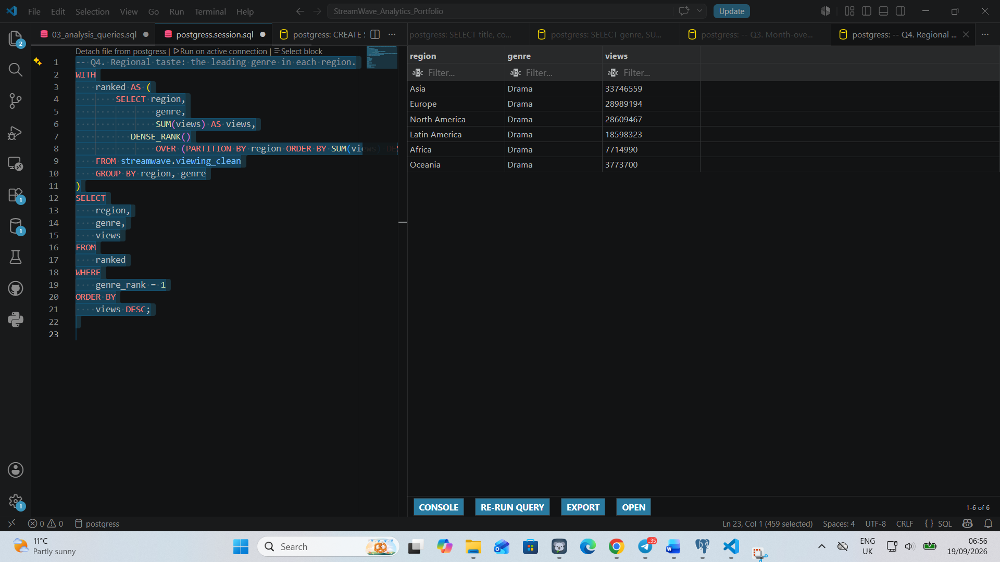

`DENSE_RANK()` identifies the leading genre within each region while preserving the regional grouping.

### High-potential titles

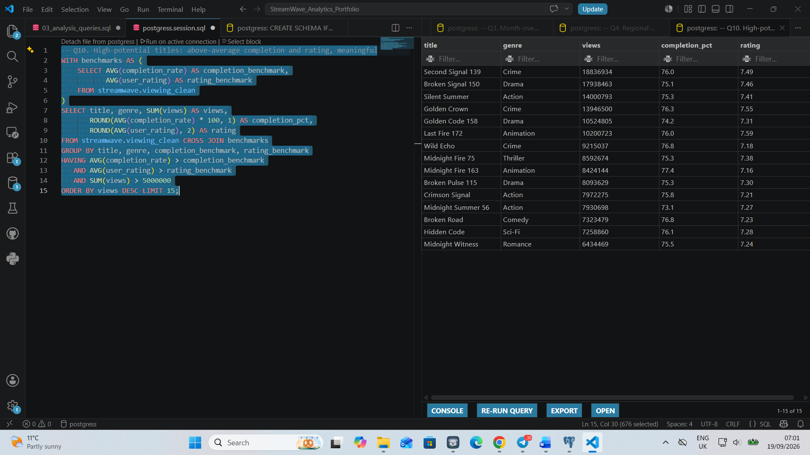

A benchmark CTE identifies titles with above-average completion and ratings that also achieved meaningful audience reach.

## Exploratory analysis

### Top titles

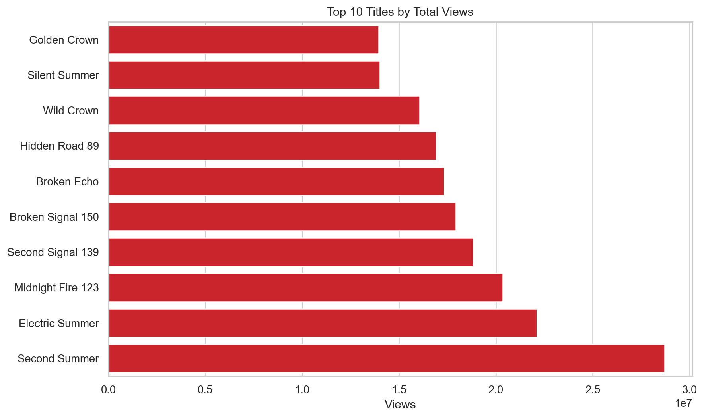

`Second Summer`, a documentary, led the catalog with approximately **28.7 million views**.

### Monthly viewing trend

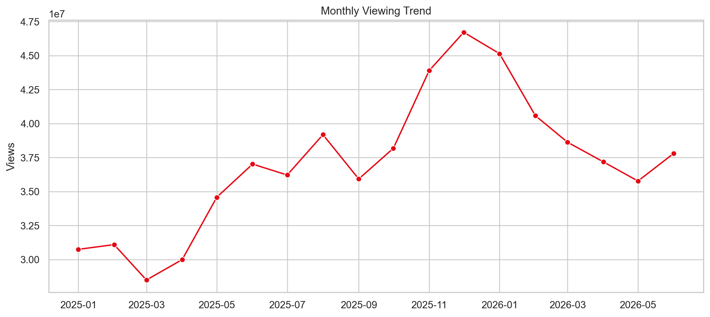

Viewing increased through the second half of 2025 and peaked in **December 2025 at 46.7 million views**, consistent with the seasonal lift built into the synthetic data.

### Genre reach and completion

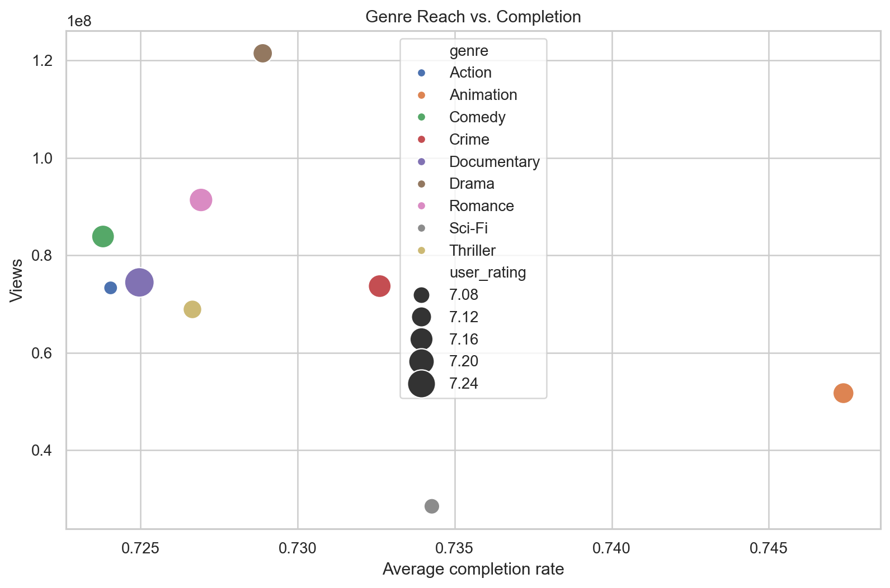

Drama generated the most total views, while animation achieved the strongest average completion rate. This suggests that the largest genre is not automatically the most engaging genre.

### Device completion

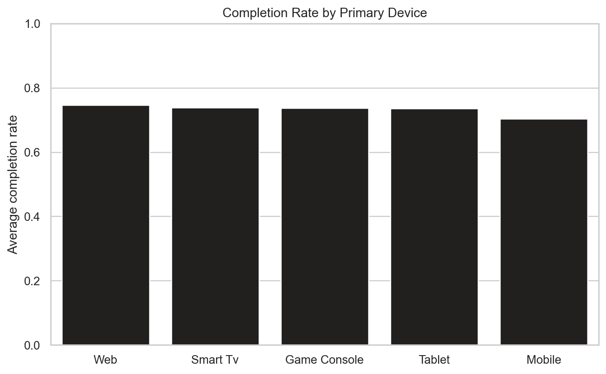

Web produced the highest average completion rate at approximately **74.6%**. Mobile was lowest at approximately **70.4%**, creating a clear product and content-packaging opportunity.

### Regional genre mix

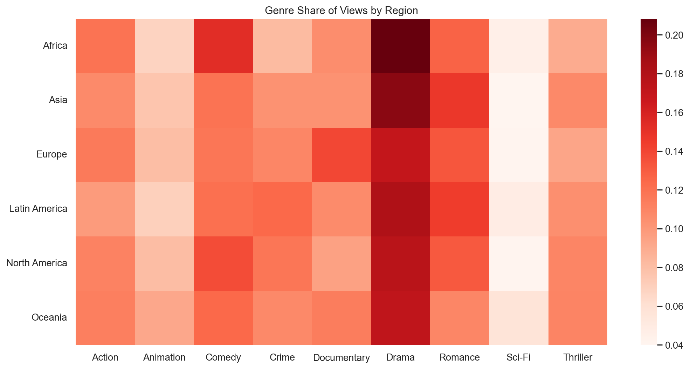

Drama was the largest genre in every region, but the distribution of secondary genres varied. A regional merchandising strategy would therefore be more useful than one identical global content mix.

### Subscription-tier revenue

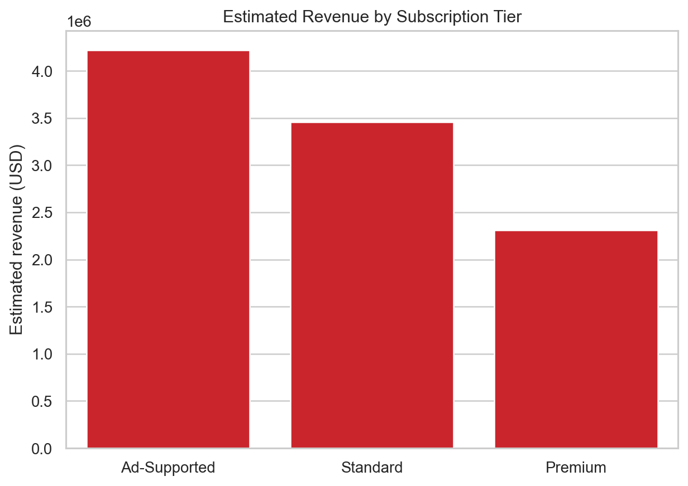

The ad-supported tier generated the most modeled revenue, about **$4.22 million**, despite Standard producing more views. The result reflects the fictional revenue assumptions and should be interpreted as a scenario, not actual streaming economics.

## Key findings

- The cleaned dataset contains **13,123 valid unique records** and **667.1 million total views**.
- December 2025 was the peak month, supporting heavier year-end release and promotion planning.
- Drama was the reach leader with **121.4 million views**.
- Animation had the highest genre completion rate at roughly **74.7%**.
- Mobile completion trailed web by about **4.3 percentage points**.
- Ad-supported viewing was the largest modeled revenue contributor.
- Recent releases received stronger demand, but several older titles continued to create meaningful catalog value.

## Recommendations

1. **Protect the year-end release calendar.** Schedule high-potential launches and larger campaigns near the November–December viewing peak.
2. **Separate reach from engagement.** Use drama to acquire attention, but promote high-completion animation and niche titles to deepen viewing.
3. **Investigate mobile drop-off.** Test shorter previews, stronger episode hooks, download prompts, and playback improvements for mobile audiences.
4. **Build tier-specific strategies.** Treat ad-supported users as a significant monetization segment while protecting the volume of Standard users.
5. **Localize discovery.** Use regional genre and language preferences to personalize home-page rows and campaign creative.

## How to reproduce the project

### 1. Generate the raw data

```bash
python python/generate_synthetic_data.py
```

The random seed is fixed, so the same dataset can be reproduced.

### 2. Load and transform in PostgreSQL

From the repository root, run:

```bash
psql -d your_database -f sql/01_create_tables.sql
psql -d your_database -f sql/02_clean_transform.sql
psql -d your_database -f sql/03_analysis_queries.sql
```

If pgAdmin is used instead of `psql`, create the raw table first, import the CSV through the Import/Export menu, and then run scripts 02 and 03 in the Query Tool.

### 3. Run the Python EDA

```bash
pip install -r requirements.txt
python python/eda_analysis.py
```

This produces the processed CSV, project summary, and six charts.

## Portfolio presentation

The [portfolio walkthrough](docs/portfolio_walkthrough.md) identifies the exact SQL results, code sections, and quality checks to capture as screenshots. It also includes a recommended visual style and interview talking points.

## Limitations

- The data is synthetic and was created for portfolio learning.
- Estimated revenue is modeled from simplified tier-level rates and is not a recognized accounting measure.
- Each title has one primary genre, so cross-genre behavior is not captured.
- Views are aggregated combinations, not individual user sessions.
- The model does not include marketing spend, licensing cost, churn, or customer-level demographics.

## About the analyst

**Nwachukwu Austine** is an Information Systems and Technology student with a professional background in television broadcasting, video production, graphic design, and media operations. This project demonstrates his transition from understanding how content is produced to using data to understand how content performs.
